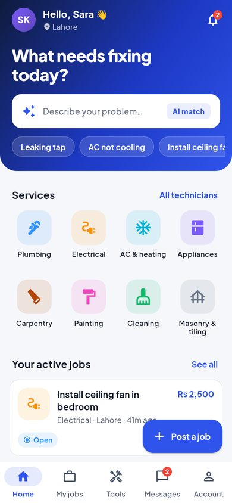
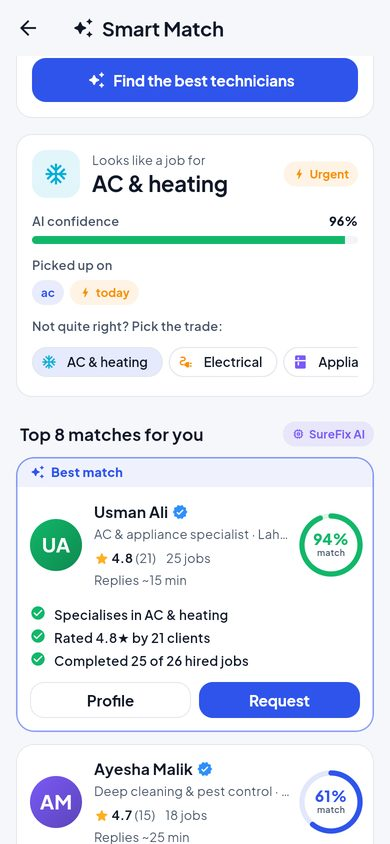
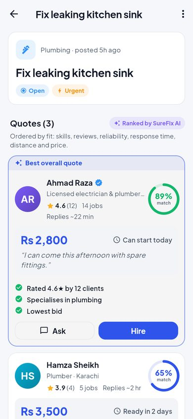
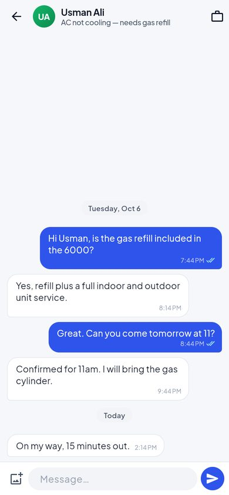
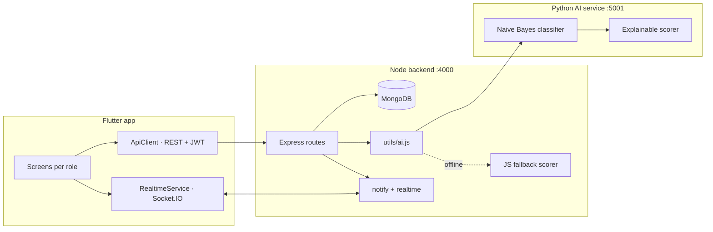

# SureFix — The Marketplace for Home Repairs and Tool Rentals

SureFix connects **clients**, **technicians** and **tool suppliers** in one
mobile app. Clients describe a problem in their own words, an **AI engine
understands it and ranks the best technicians — explaining why** — and the
job is quoted, hired, tracked, chatted about and reviewed in one place.
Anything a job needs can be rented from local suppliers instead of bought.

<p align="center">
  
  
  
  
</p>

| Layer | Tech |
|---|---|
| Mobile app | Flutter 3.35 (Android, iOS, web, desktop) · Material 3 · light & dark themes |
| Backend | Node.js 18+ · Express 5 · MongoDB (Mongoose) · JWT auth · Socket.IO realtime |
| AI service | Python · FastAPI · Naive Bayes text classifier + explainable ranking |
| Ops | Docker Compose · GitHub Actions CI · 100+ automated tests |

---

## What each role can do

**Client**
- **Smart Match** — type "AC is blowing warm air, need it today": the AI detects the trade
  (*AC & heating, 96 % confidence*), the urgency (*urgent*), and ranks every technician
  with a match score and reasons ("Specialises in AC & heating", "Rated 4.8★ by 21 clients",
  "Usually responds in ~15 min").
- Post a job (photos, budget, urgency, preferred date) with **live AI category suggestions**,
  or send a **direct request** to one technician.
- Compare **AI-ranked quotes** (skills, reviews, reliability, response time, distance, price) with
  cautions like "17 % over your budget"; chat with bidders before hiring; hire, track the
  timeline, mark complete, rate and review.
- Browse/filter technicians and view rich profiles (stats, rating breakdown, reviews).
- Rent tools by date range (pickup or delivery, deposit shown) or buy on installments; review tools.

**Technician** — dashboard with earnings and an availability switch · direct requests ·
"jobs matching your skills" · search & filter open jobs (live new-job alerts) · send/withdraw
quotes · chat · complete jobs · professional profile (skills, rate, experience, photo) · ID verification.

**Supplier** — revenue dashboard · list tools with photos, deposit, stock and installments ·
approve / decline rental requests (stock is reserved atomically) · mark returned · overdue alerts.

**Admin** — analytics (KPIs, 7-day charts, jobs by status, top services, AI engine status) ·
user search with suspend/reactivate · KYC review queue with document viewer · reports
(trust & safety) queue · oversight of all jobs and tool listings.

**Everyone** — realtime notifications with deep links, unread badges, chat with read receipts,
typing indicators and photos, report users/jobs/tools, dark mode, change password.

---

## Quick start (Windows)

Everything runs natively — see **[WINDOWS_SETUP.md](./WINDOWS_SETUP.md)** for the full guide.

```bat
setup.bat                      :: once (and again after pulling new code)

scripts\start-mongo.bat        :: skip if MongoDB runs as a Windows service
scripts\start-backend.bat      :: http://localhost:4000
scripts\start-ai.bat           :: http://localhost:5001  (docs at /docs)
scripts\start-mobile.bat       :: add "chrome" or a device id as an argument
```

Want the demo data (13 accounts, jobs in every state, quotes, reviews, tools, rentals,
chats)? Run `scripts\reset-demo-data.bat` — it **wipes the database** first and asks
you to type YES. All demo passwords are `password123`:

| Role | Email |
|---|---|
| Client | `client@demo.com` (also `client2@demo.com`) |
| Technician | `tech@demo.com` (also `tech2`…`tech8@demo.com`) |
| Supplier | `supplier@demo.com` (also `supplier2@demo.com`) |
| Admin | `admin@demo.com` |

Debug builds show one-tap **demo account buttons** on the login screen.

### Real Android phone over USB

```bat
adb reverse tcp:4000 tcp:4000
```
Run once per USB connection, before launching the app. Or point the app at your PC's
LAN IP: `flutter run --dart-define=API_BASE_URL=http://192.168.1.10:4000`.

### Docker (backend + AI + MongoDB)

```bash
docker compose up --build
docker compose exec backend npm run seed -- --force   # optional demo data
```

---

## Tests

```bat
scripts\test-all.bat          :: backend + AI service + Flutter
```

| Suite | Command | What it covers |
|---|---|---|
| Backend (54) | `cd backend && npm test` | Auth, job state machine, direct requests, bids, privacy, rentals & stock, chat threads, admin, reports, uploads, AI fallback — against a real MongoDB |
| AI service (34) | `cd ai-service && pytest` | Stemming, held-out classifier accuracy (≥ 85 %), urgency, scoring properties, API contract, **JS ↔ Python parity** |
| Mobile (13) | `cd mobile && flutter test` | Models, formatting, widgets (light/dark), onboarding/login flows |

GitHub Actions runs all three on every push (`.github/workflows/ci.yml`).

---

## Architecture



- The backend **never depends** on the AI service being up: if it's unreachable,
  `backend/src/services/scoring.js` (a line-by-line port of the Python scorer, verified by a
  parity test) answers instead, and responses say `"engine": "fallback"`.
- Details: [docs/ARCHITECTURE.md](./docs/ARCHITECTURE.md) (data model, full REST API, realtime
  events, AI pipeline, security) · [ai-service/README.md](./ai-service/README.md) (model details).

## Project layout

```
backend/      Express API, Socket.IO, Mongoose models, Jest tests
ai-service/   FastAPI service: classifier, urgency, scoring, pytest tests
mobile/       Flutter app (lib/core = design system, lib/screens per role)
scripts/      Windows start / test / demo-data helpers
docs/         Architecture, installation, user guide, status, screenshots
```

## Documentation

| | |
|---|---|
| [WINDOWS_SETUP.md](./WINDOWS_SETUP.md) | Install + run on Windows, upgrading from v1, troubleshooting |
| [docs/INSTALLATION.md](./docs/INSTALLATION.md) | All platforms, environment variables, Docker, mobile builds |
| [docs/ARCHITECTURE.md](./docs/ARCHITECTURE.md) | Components, data model, REST API, realtime events, AI pipeline |
| [docs/USER_GUIDE.md](./docs/USER_GUIDE.md) | Walkthrough for each role |
| [docs/STATUS.md](./docs/STATUS.md) | What's implemented, known limitations, changelog |

## Configuration notes

- Currency defaults to **Rs**; change it with `--dart-define=CURRENCY=$`.
- The MongoDB database is still named `fixit` (from v1) so existing data keeps working.
- Set a strong `JWT_SECRET` in `backend/.env` before deploying anywhere public
  (the server refuses to start in production with the default).
