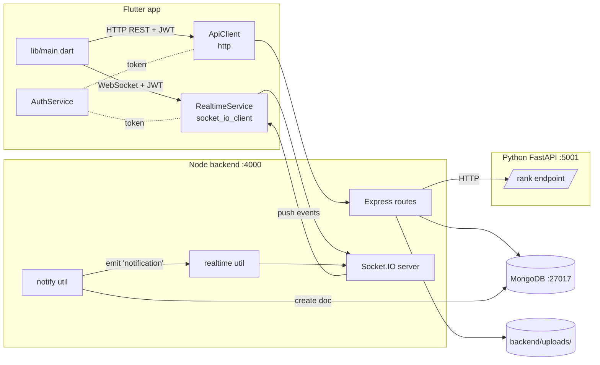
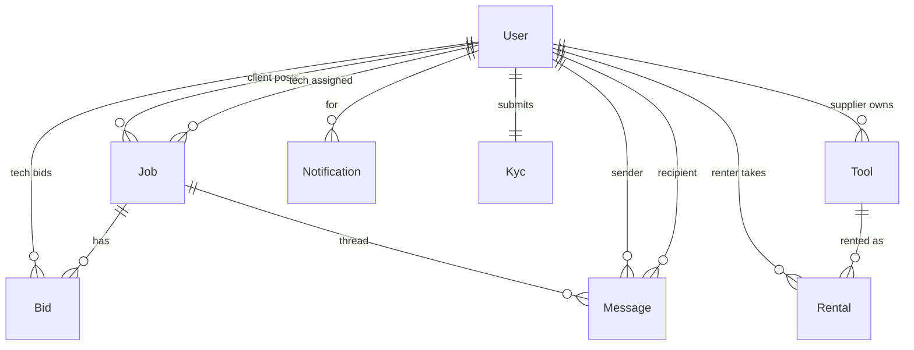
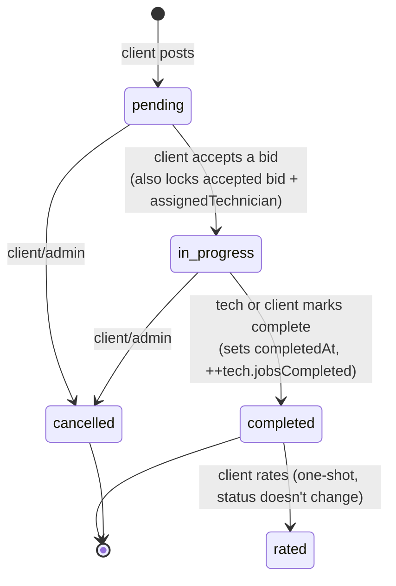

# Architecture

## Top-level layout

```
talha/
├── backend/         Node.js + Express + MongoDB REST API + Socket.IO  (:4000)
├── ai-service/      Python FastAPI technician-ranking microservice    (:5001)
├── mobile/          Flutter app (web / Linux / Android / iOS)
├── scripts/         install-prereqs + start-* helpers
├── setup.sh         per-project bootstrap
└── docs/            this folder
```

---

## Component diagram



The backend has both an HTTP server (Express) and a WebSocket server
(Socket.IO) sharing the same `http.Server`. They authenticate the same way:
JWTs issued by `/api/auth/login`. HTTP routes use `Authorization: Bearer <jwt>`;
the socket reads the token from `socket.handshake.auth.token`.

---

## Data model



### Collections (Mongoose schemas)

| Schema | File | Notable fields |
|---|---|---|
| `User` | `backend/src/models/User.js` | role enum (client/technician/supplier/admin), kycStatus, rating, ratingCount, jobsCompleted, jobsAssigned, avgResponseMinutes, skills[], bio, avatar, password (bcrypt-hashed via `pre('save')`) |
| `Job` | `backend/src/models/Job.js` | client, title, description, category, budget, location, images[], status (pending/in_progress/completed/cancelled), assignedTechnician, acceptedBid, bids[] (sub-doc with technician/amount/message/etaDays/status), completedAt, rating, review |
| `Tool` | `backend/src/models/Tool.js` | supplier, name, description, category, image, rentPricePerDay, purchasePrice, installmentMonths, installmentMonthly, available, stock |
| `Rental` | `backend/src/models/Rental.js` | tool, renter, type (rent/installment), startDate, endDate, days, totalCost, monthsRemaining, status (active/returned/completed) |
| `Message` | `backend/src/models/Message.js` | job, sender, recipient, text, readAt |
| `Notification` | `backend/src/models/Notification.js` | user, type, title, body, data (object), readAt |
| `Kyc` | `backend/src/models/Kyc.js` | user (unique), fullName, idType (cnic/passport/driver_license), idNumber, idFrontImage, idBackImage, selfieImage, status (pending/approved/rejected), rejectionReason |

User-public projection (`User.toPublicJSON`) strips `password` and exposes
`id` (mapped from `_id`).

---

## REST API reference

All paths prefixed with `/api`. Protected routes require
`Authorization: Bearer <jwt>`. Bodies are JSON unless noted.

### Auth — `routes/auth.js`

| Method | Path | Auth | Body | Notes |
|---|---|---|---|---|
| POST | `/auth/register` | none | `{name, email, password (≥6), role, phone?}` | Rejects `role: admin`. Returns `{token, user}`. |
| POST | `/auth/login` | none | `{email, password}` | Returns `{token, user}`. |

### Users — `routes/users.js`

| Method | Path | Auth | Notes |
|---|---|---|---|
| GET | `/users/me` | yes | Current user's public projection |
| PATCH | `/users/me` | yes | Allowed fields: `name`, `phone`, `bio`, `skills`, `avatar` |
| GET | `/users/technicians` | yes | All technicians (no pagination) |
| GET | `/users/:id` | yes | Public projection of any user |
| GET | `/users/me/notifications` | yes | Last 50, newest first |
| POST | `/users/me/notifications/:id/read` | yes | Marks as read |

### Jobs — `routes/jobs.js`

| Method | Path | Auth | Notes |
|---|---|---|---|
| GET | `/jobs?status=&mine=1` | yes | Filtering rules below |
| POST | `/jobs` | client | `{title, description, category, budget, location, images?}`. Emits `job:new` to all connected technicians. |
| GET | `/jobs/:id` | yes | Populates client, assignedTechnician, bids.technician |
| POST | `/jobs/:id/bids` | technician | `{amount (>0), message?, etaDays?}`. One bid per technician. Emits `job:bid` to client. |
| DELETE | `/jobs/:id/bids/me` | technician | Withdraws own bid (only while status `pending`). Notifies client. |
| POST | `/jobs/:id/accept/:bidId` | client | Marks job `in_progress`, sets assignedTechnician, increments tech's `jobsAssigned`. Emits `job:hired`. |
| PATCH | `/jobs/:id/status` | client/tech/admin (must be participant) | `{status}` from the `Job.STATUSES` enum. On `completed`: sets `completedAt` and increments tech's `jobsCompleted`. Emits `job:status`. |
| POST | `/jobs/:id/rate` | client | `{rating (1-5), review?}`. Updates tech's running average. Emits `job:rated`. |
| GET | `/jobs/:id/ranked-bids` | yes | Calls AI service with each bid's tech metrics + `jobCategory`. Returns the bids list with a `score` field added. |

**`GET /jobs` filter rules:**
- `status=<x>` always filters by that status.
- `mine=1` + role `client` → `client = me`.
- `mine=1` + role `technician` → `assignedTechnician = me`.
- No `mine`, role `technician` → defaults to `status: pending` (the open-jobs view).
- No `mine`, role `client` → all jobs (rarely used in UI).

### Tools — `routes/tools.js`

| Method | Path | Auth | Notes |
|---|---|---|---|
| GET | `/tools?mine=1` | yes | `mine=1` for supplier returns own tools. Otherwise returns all. |
| POST | `/tools` | supplier | Creates tool with `supplier = me`. |
| PATCH | `/tools/:id` | supplier (owner) | Updates fields. |
| DELETE | `/tools/:id` | supplier (owner) | Hard delete. |
| POST | `/tools/:id/rent` | yes | `{days (≥1)}`. Refuses self-rent. Decrements `stock`; sets `available=false` at 0. Creates `Rental` doc. Notifies supplier. Emits `tool:rented`. |
| POST | `/tools/:id/purchase` | yes | Requires `installmentMonths > 0`. Refuses self-purchase. Same stock logic. Emits `tool:purchased`. |
| GET | `/tools/me/rentals` | yes | What I've rented/bought. |
| GET | `/tools/me/incoming` | supplier | Rentals/purchases on my tools. |

### Messages — `routes/messages.js`

| Method | Path | Auth | Notes |
|---|---|---|---|
| GET | `/messages/:jobId` | participant or admin | Chronological. |
| POST | `/messages/:jobId` | participant | `{text}`. Recipient is the other participant (returns 400 if no tech assigned yet). Notifies + emits `message:new` to **both** sender and recipient. |

### KYC — `routes/kyc.js`

| Method | Path | Auth | Notes |
|---|---|---|---|
| GET | `/kyc/me` | yes | Current user's KYC submission, or `null`. |
| POST | `/kyc` | yes | **Multipart** route (multer fields `idFront`, `idBack`, `selfie` + JSON-style fields `fullName`, `idType`, `idNumber`). Upserts on `user`. Sets `user.kycStatus = pending`. **Note**: the Flutter screen sends JSON without files — submission works, image fields stay empty. |

### Admin — `routes/admin.js` (all require `role: admin`)

| Method | Path | Notes |
|---|---|---|
| GET | `/admin/stats` | `{users, jobs, tools, pendingKyc}` counts. |
| GET | `/admin/users?role=` | Filterable. |
| DELETE | `/admin/users/:id` | Refuses self-delete. |
| GET | `/admin/kyc?status=` | Filterable. |
| POST | `/admin/kyc/:id/verify` | `{decision: approved|rejected, reason?}`. Updates `User.kycStatus`. Notifies the submitter. |
| GET | `/admin/jobs` | Every job, populated. |

---

## Real-time (Socket.IO)

The backend's HTTP server is wrapped in `http.createServer(app)` and Socket.IO
is attached to the same listener (`backend/src/utils/realtime.js`).

### Handshake

```
client → server: io(baseUrl, { auth: { token: '<jwt>' } })
server: jwt.verify(token) → socket.userId, socket.role
        socket.join(`user:<userId>`)
        socket.join(`role:<role>`)
```

### Events emitted by server

| Event | Recipient room | Payload | Triggered by |
|---|---|---|---|
| `notification` | `user:<id>` | `{_id, type, title, body, data, createdAt}` | Every `notify()` call (so this duplicates the per-event toasts below; mobile only toasts on `notification`, treats the others as live-refresh signals). |
| `job:new` | `role:technician` (broadcast) | `{jobId, title, category, budget}` | Client posts a job. No DB notification (would spam every tech). Mobile toasts directly. |
| `job:bid` | `user:<clientId>` | `{jobId, title, technicianName, amount, cancelled?}` | Tech places or withdraws a bid. |
| `job:hired` | `user:<techId>` | `{jobId, title, amount}` | Client accepts a bid. |
| `job:status` | `user:<otherPartyId>` | `{jobId, title, status}` | Either party changes status. |
| `job:rated` | `user:<techId>` | `{jobId, title, rating, review}` | Client rates the job. |
| `tool:rented` | `user:<supplierId>` | `{toolId, toolName, renterName, days, totalCost}` | Tool rented. |
| `tool:purchased` | `user:<supplierId>` | `{toolId, toolName, renterName, totalCost, months}` | Tool purchased on installments. |
| `message:new` | `user:<recipientId>` AND `user:<senderId>` | `{_id, job, sender, text, createdAt}` | Message sent (both ends so the sender's chat updates without a refetch). |

### Mobile subscription

`mobile/lib/services/realtime_service.dart` subscribes to all of the above and
fans them out via a single `Stream<RealtimeEvent>`. Listeners:

- `main.dart` — toasts on `notification` + `job:new` (the only two intended for global toast).
- `client_home._MyJobsTab` — re-loads on `job:bid`, `job:status`, `job:rated`.
- `tech_home._JobsList` (open) — re-loads on `job:new`.
- `tech_home._JobsList` (mine) — re-loads on `job:hired`, `job:status`.
- `supplier_home` — re-bumps both tab keys on `tool:rented` / `tool:purchased`.
- `notifications_screen` — prepends new `notification` events to the list live.
- `messages_screen` — appends `message:new` for the open job; smart-scrolls only when at bottom.

---

## AI ranking service

`ai-service/app/main.py` exposes:

| Method | Path | Body | Returns |
|---|---|---|---|
| GET | `/` | — | `{ok, service}` |
| GET | `/health` | — | `{status: healthy}` |
| POST | `/rank` | `{technicians: [...], jobCategory?: string}` | `{ranked: [...]}` (each item has a `score` 0–5, sorted desc) |
| POST | `/score` | one technician dict | `{score}` |

### Scoring

Weighted sum, then scaled to 0–5. Weights live in
`ai-service/app/ranker.py`:

| Component | Weight | Source field |
|---|---|---|
| Rating (×confidence) | 0.40 | `rating` × min(`ratingCount`/10, 1) |
| Completion rate | 0.25 | `completionRate` (clamped 0–1) |
| Skill match | 0.15 | `skillMatch` (1 if pre-computed, else 1 if `jobCategory ∈ skills` else 0) |
| Response speed | 0.10 | `responseSpeed` (clamped 0–1) |
| Experience | 0.10 | min(`jobsCompleted`/50, 1) |

### Local fallback

If the AI service is unreachable, `backend/src/utils/ai.js` runs the same
formula in JS so `/api/jobs/:id/ranked-bids` keeps working. Weights are kept
in sync; if you change one, change the other.

---

## Job lifecycle



Bid sub-statuses on accept: the accepted bid becomes `accepted`, the rest
flip to `rejected`.

---

## KYC flow

```mermaid
sequenceDiagram
    participant U as User (tech/supplier)
    participant API as Backend
    participant DB as Mongo
    participant A as Admin

    U->>API: POST /api/kyc (fullName, idType, idNumber)
    API->>DB: Kyc.findOneAndUpdate({user}, ..., {upsert: true})<br/>User.kycStatus = 'pending'
    API-->>U: 201 Kyc

    A->>API: GET /api/admin/kyc
    API-->>A: list

    A->>API: POST /api/admin/kyc/:id/verify {decision, reason?}
    API->>DB: Kyc.status = decision; User.kycStatus = decision
    API->>U: notify('kyc', ...) → 'notification' socket event
    A-->>A: list reloads
```

---

## File map (where things live)

### Backend
```
backend/src/
├── server.js              Express + Socket.IO bootstrap, route mounting, error handler
├── middleware/
│   ├── auth.js            authRequired (JWT) + requireRole(...roles)
│   └── upload.js          multer disk-storage config
├── models/                Mongoose schemas (one per collection)
├── routes/                One file per top-level resource (auth, users, jobs, tools, messages, kyc, admin)
└── utils/
    ├── ai.js              AI ranker HTTP client + JS fallback
    ├── notify.js          Notification doc create + socket emit
    ├── realtime.js        Socket.IO init + emit / emitRole helpers
    └── seed.js            Demo-data seeder (npm run seed)
```

### Mobile
```
mobile/lib/
├── main.dart              MaterialApp, root router, global ScaffoldMessenger,
│                          realtime → toast handler
├── services/
│   ├── api_client.dart    Static get/post/patch/delete with JSON + JWT
│   ├── api_config.dart    Per-platform baseUrl (web/iOS/android/desktop) +
│   │                      --dart-define=API_BASE_URL override
│   ├── auth_service.dart  Singleton; login/register/logout/refreshUser;
│   │                      starts/stops RealtimeService
│   └── realtime_service.dart  socket_io_client wrapper, broadcast Stream
├── models/                Plain Dart DTOs with fromJson/toJson
├── widgets/
│   ├── app_drawer.dart    Profile / Notifications / KYC / Logout
│   └── status_chip.dart   Colored pill for status strings
└── screens/
    ├── auth/              login, register
    ├── client/            client_home (tabs), post_job, job_detail_client
    ├── technician/        tech_home (tabs), tech_job_detail
    ├── supplier/          supplier_home (tabs), add_tool
    ├── admin/             admin_home (3 tabs in one file: stats, users, kyc)
    └── shared/            tools_list, messages, notifications, kyc, profile
```
