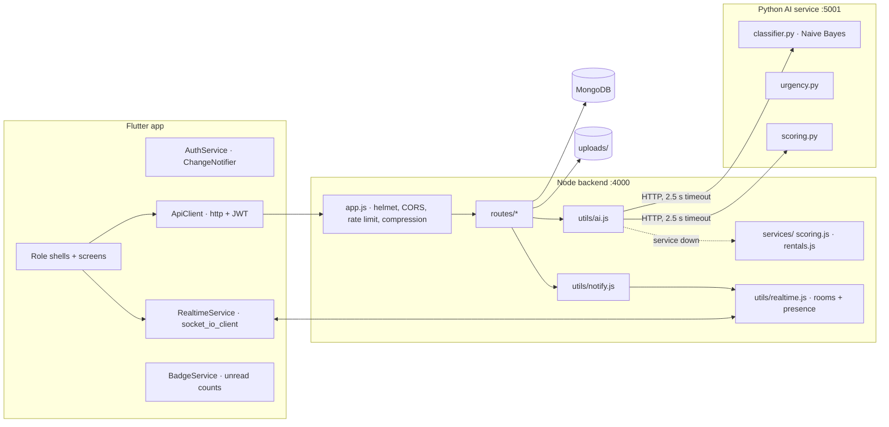
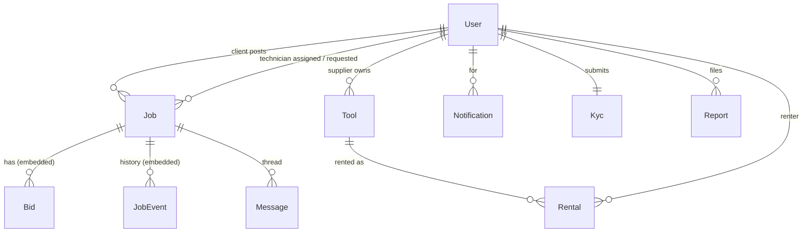
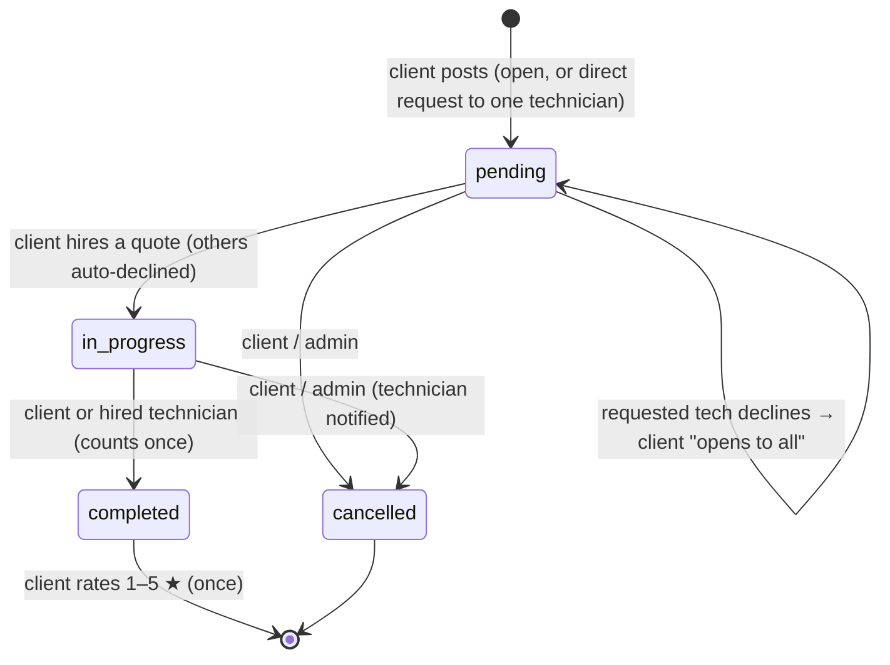
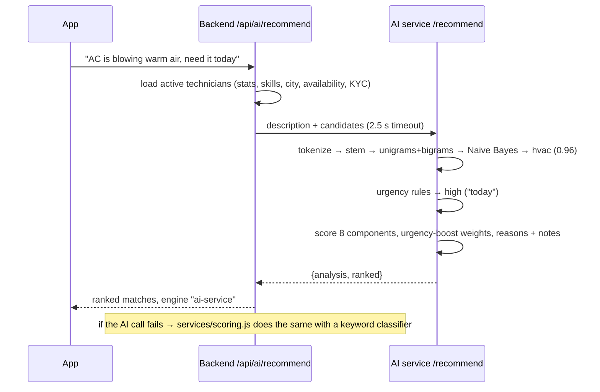

# Architecture

```
surefixing/
├── backend/      Node 18+ · Express 5 · Mongoose · Socket.IO       (:4000)
├── ai-service/   Python · FastAPI · Naive Bayes + explainable scorer (:5001)
├── mobile/       Flutter 3.35 (Android / iOS / web / desktop)
├── scripts/      Windows start / test / demo-data helpers
├── docker-compose.yml   MongoDB + backend + AI service in containers
└── docs/
```

## Components



- **One JWT for everything**: HTTP uses `Authorization: Bearer <jwt>`; the socket sends it in
  `handshake.auth.token`. Suspended users are rejected at login, on every API call and their
  sockets are disconnected.
- **AI is optional at runtime**: `utils/ai.js` calls the Python service with a timeout and falls
  back to `services/scoring.js`, a port of the same scorer (kept identical by a parity test in
  `ai-service/tests/test_scoring.py`). Every AI response carries `engine: "ai-service" | "fallback"`.
- **Express 5** forwards async errors to one error handler (`middleware/error.js`), which turns
  Mongoose cast/validation errors, multer errors and bad JSON into clean `400`s.

## Data model



| Model | Notable fields |
|---|---|
| **User** | role (client/technician/supplier/admin), status (active/suspended), kycStatus, avatar, city, bio · technician profile: headline, skills[], hourlyRate, experienceYears, isAvailable · stats: rating, ratingCount, jobsCompleted, jobsAssigned, avgResponseMinutes (+ responseSamples), lastSeenAt |
| **Job** | client, title, description, category, budget, city, location, urgency (low/normal/high/emergency), preferredDate, images[], status (pending/in_progress/completed/cancelled), requestedTechnician + requestDeclined (direct requests), assignedTechnician, acceptedBid, agreedPrice, bids[] {technician, amount, etaDays, message, status}, history[] {status, note, by, at}, cancelReason, rating, review |
| **Tool** | supplier, name, description, category, condition, city, images[] (+ legacy image), rentPricePerDay, deposit, purchasePrice, installmentMonths/Monthly, available (listed), stock, rating, ratingCount, rentalsCount |
| **Rental** | tool, renter, supplier, type (rent/installment), startDate, endDate, days, totalCost, deposit, fulfillment (pickup/delivery), note, status (requested/active/returned/completed/rejected/cancelled), rejectionReason, approvedAt, returnedAt, rating, review · computed in responses: overdue, daysLeft |
| **Message** | job, sender, recipient, text, image, readAt — a thread is (job, client, technician) |
| **Notification** | user, type, title, body, data {jobId / toolId / rentalId … for deep links}, readAt |
| **Kyc** | user, fullName, idType, idNumber, idFrontImage, idBackImage, selfieImage, status, rejectionReason |
| **Report** | reporter, targetType (user/job/tool), targetId, targetLabel, reason, details, status (open/resolved/dismissed), resolutionNote, resolvedBy |

All fields added in v2 have defaults, so documents created by v1 load unchanged. The database
name stays `fixit`.

## Lifecycles

### Job



Transitions are enforced in `routes/jobs.js` (`TRANSITIONS`). Every step appends to
`history` (shown as the timeline). Phone numbers and emails are only revealed between the
client and the hired technician.

### Rental

```
requested ──approve──▶ active ──return──▶ returned     (rent)
requested ──approve──▶ active ──complete─▶ completed   (installment)
requested ──reject───▶ rejected      requested ──cancel (renter)──▶ cancelled
```

Stock is reserved on approve with an atomic `findOneAndUpdate({stock: {$gt: 0}})`, so two
approvals can never oversell the last unit; it is released on return.

## REST API

All paths start with `/api`. 🔒 = needs a JWT. Lists accept `?page=&limit=` and return a plain
array with the total in the `X-Total-Count` header. Errors are `{ error, errors? }`.

### Auth & users

| Method | Path | Notes |
|---|---|---|
| POST | `/auth/register` | `{name, email, password, role, phone?, city?}` (admin can't self-register) → `{token, user}` |
| POST | `/auth/login` | → `{token, user}`; `403 {code:"suspended"}` for suspended accounts |
| POST | `/auth/change-password` 🔒 | `{currentPassword, newPassword}` |
| GET / PATCH | `/users/me` 🔒 | Profile; PATCH whitelists name, phone, bio, city, headline, skills[], hourlyRate, experienceYears, isAvailable |
| POST | `/users/me/avatar` 🔒 | multipart `avatar` |
| GET | `/users/me/summary` 🔒 | Dashboard numbers for the caller's role |
| GET | `/users/me/notifications` 🔒 | `?unread=1` · also `/unread-count`, `POST /read-all`, `POST /:id/read` |
| GET | `/users/technicians` 🔒 | `?q=&category=&city=&minRating=&available=1&verified=1&sort=rating\|jobs\|price\|newest` |
| GET | `/users/:id` 🔒 | Public profile (email/phone only for self/admin) + `online` |
| GET | `/meta` | Categories, tool categories, urgency levels, report reasons (public) |

### Jobs

| Method | Path | Notes |
|---|---|---|
| GET | `/jobs` 🔒 | Client: own jobs. Technician: open marketplace (`?q=&category=&city=&urgency=&matching=1&sort=newest\|budget`), `?view=requests`, `?view=bids`, `?mine=1&status=`. Admin: all |
| POST | `/jobs` 🔒 client | multipart: title, description, category, budget, city, location, urgency, preferredDate, requestedTechnician?, `images` (≤ 5) |
| GET | `/jobs/:id` 🔒 | Visible to owner, admin, and technicians who may see it; includes `history` |
| POST | `/jobs/:id/bids` 🔒 technician | `{amount, etaDays?, message?}`; records response time |
| DELETE | `/jobs/:id/bids/me` 🔒 technician | Withdraw a pending quote |
| POST | `/jobs/:id/decline` 🔒 technician | Requested technician declines `{reason?}` |
| POST | `/jobs/:id/open` 🔒 client | Turn a direct request into an open job |
| POST | `/jobs/:id/accept/:bidId` 🔒 client | Hire; sets agreedPrice; other bidders notified |
| PATCH | `/jobs/:id/status` 🔒 | `{status: completed\|cancelled, note?}` per the state machine |
| POST | `/jobs/:id/rate` 🔒 client | `{rating 1–5, review?}` once, after completion |
| GET | `/jobs/:id/ranked-bids` 🔒 owner/admin | Quotes ranked by the AI: `score`, `matchPercent`, `reasons[]`, `notes[]`, `breakdown`, `engine` |
| GET | `/reviews/technician/:id` 🔒 | Reviews · `/summary` → `{count, average, distribution}` |

### Tools & rentals

| Method | Path | Notes |
|---|---|---|
| GET | `/tools` 🔒 | `?q=&category=&city=&minPrice=&maxPrice=&available=1&installment=1&sort=newest\|price_asc\|price_desc\|rating\|popular`; supplier `?mine=1` |
| GET | `/tools/:id` 🔒 | Detail + recent reviews |
| POST / PATCH | `/tools` · `/tools/:id` 🔒 supplier | multipart; field whitelist; `images` (≤ 4) appended, `removeImages` JSON list |
| DELETE | `/tools/:id` 🔒 supplier/admin | Refused while rentals are active; pending requests cancelled |
| POST | `/tools/:id/rent` 🔒 | `{startDate, endDate}` or `{days}`, `fulfillment`, `note` → rental `requested` |
| POST | `/tools/:id/purchase` 🔒 | Installment request |
| GET | `/rentals` 🔒 | `?as=renter\|supplier&status=a,b` |
| GET | `/rentals/:id` 🔒 | Renter, supplier or admin |
| POST | `/rentals/:id/approve` · `/reject` · `/return` · `/complete` 🔒 supplier | Lifecycle (see above) |
| POST | `/rentals/:id/cancel` · `/review` 🔒 renter | Cancel a request · review after it ends |

### Messages, KYC, reports, AI, admin

| Method | Path | Notes |
|---|---|---|
| GET | `/messages` 🔒 | Inbox: one row per (job, other person) with last message + unread |
| GET | `/messages/unread-count` 🔒 | |
| GET / POST | `/messages/:jobId` 🔒 | Thread (`?with=<technicianId>` for clients); POST JSON `{text, to?}` or multipart `image`. Reading marks as read |
| POST | `/messages/:jobId/read` 🔒 | Mark read |
| GET / POST | `/kyc/me` · `/kyc` 🔒 | Multipart `idFront`, `idBack`, `selfie` (front + selfie required); approved KYC is locked |
| POST | `/reports` 🔒 | `{targetType, targetId, reason, details?}`; duplicates refused |
| GET | `/ai/status` 🔒 | Is the Python service reachable? |
| POST | `/ai/analyze` 🔒 | `{text}` → `{category, confidence, categories[], urgency, urgencyTerms[], keywords[], engine}` |
| POST | `/ai/recommend` 🔒 | `{description, category?, city?, budget?, urgency?, limit?}` → `{analysis, category, urgency, ranked[], engine}` |
| GET | `/admin/stats` 🔒 admin | Counts, breakdowns by role/status/category, job & rental value, 7-day series |
| GET | `/admin/users` 🔒 admin | `?q=&role=&status=` · `PATCH /admin/users/:id/status` · `DELETE /admin/users/:id` |
| GET / POST | `/admin/kyc` · `/admin/kyc/:id/verify` 🔒 admin | `{decision, reason?}` |
| GET / POST | `/admin/reports` · `/admin/reports/:id/resolve` 🔒 admin | `{status: resolved\|dismissed, note?, suspendUser?}` |
| GET | `/admin/jobs` · `/admin/tools` 🔒 admin | Oversight lists |
| GET | `/health` | `{ok, db, uptime}` |

## Realtime (Socket.IO)

Each socket joins `user:<id>` and `role:<role>`. Presence (open sockets per user) powers the
green "online" dots; `lastSeenAt` is updated on connect/disconnect.

| Event | To | Payload | When |
|---|---|---|---|
| `notification` | user | `{_id, type, title, body, data, createdAt}` | Every persisted notification (toast + badge) |
| `job:new` | role:technician | `{jobId, title, category, budget, city, urgency}` | Open job posted / opened to all |
| `job:request` | technician | `{jobId, title, clientName}` | Direct request |
| `job:bid` | client | `{jobId, technicianName, amount, cancelled?}` | Quote placed / withdrawn |
| `job:hired` | technician | `{jobId, title, amount}` | Quote accepted |
| `job:status` | other parties | `{jobId, status}` | Completed / cancelled / filled / request declined |
| `job:rated` | technician | `{jobId, rating, review}` | Review left |
| `rental:new` | supplier | `{rentalId, toolName, renterName, …}` | Rental or installment requested |
| `rental:update` | renter + supplier | `{rentalId, status}` | Any rental status change |
| `message:new` | sender + recipient | message + `senderName`, `jobTitle` | Chat message |
| `message:read` | sender | `{jobId, by}` | Recipient read the thread (✓✓) |
| `typing` | client → server → other party | `{jobId, to/from, typing}` | Typing indicator |
| `kyc:new`, `report:new` | role:admin | ids | New KYC submission / report |

## AI pipeline



Scoring components, weights and the classifier are documented in
[ai-service/README.md](../ai-service/README.md).

## Security

- Passwords: bcrypt (10 rounds). JWT (HS256) with configurable expiry; production refuses the
  default secret.
- `helmet` headers; CORS allow-list via `CORS_ORIGINS`; rate limits: 1000 req / 15 min per IP
  on the API and 30 / 15 min on login + register.
- Input validation with `express-validator` on every write; field whitelists on profile and
  tool updates (no mass assignment); uploads are images only, 10 MB max, random file names;
  failed requests delete already-uploaded files.
- Authorization in every handler: ownership checks for jobs, tools, rentals, chat threads;
  contact details hidden until hire; suspended accounts locked out everywhere.

## File map

```
backend/src/
├── app.js / server.js     app factory (used by tests) · HTTP + Socket.IO + graceful shutdown
├── config/                index.js (env with defaults) · catalog.js (categories, enums)
├── middleware/            auth · upload (images only) · validate · error
├── models/                User Job Tool Rental Message Notification Kyc Report
├── routes/                auth users jobs tools rentals messages kyc reviews reports ai meta admin
├── services/              scoring.js (AI fallback) · rentals.js (serialisation, queries)
└── utils/                 ai.js · notify.js · realtime.js · http.js · seed.js · create-admin.js

ai-service/app/            main.py · classifier.py · training_data.py · urgency.py · scoring.py · text.py · ranker.py (v1 API)

mobile/lib/
├── main.dart / app.dart   bootstrap · theme · root gate · global realtime toasts
├── core/                  theme.dart (design system) · catalog.dart · format.dart
├── services/              api_client · auth · realtime · badges · settings · navigation
├── models/                user job tool rental message app_notification recommendation
├── widgets/               cards · match_card · pills · states · media · visuals · dialogs · async_list …
└── screens/               shells.dart · routes.dart · auth/ client/ technician/ supplier/ admin/ shared/
```
